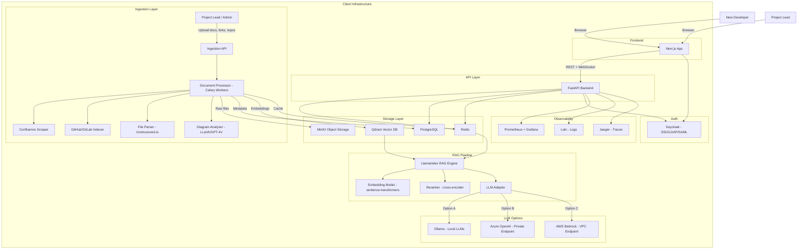
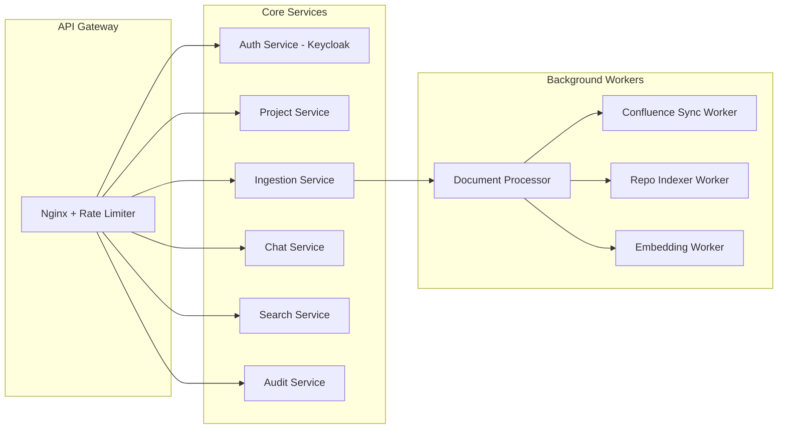
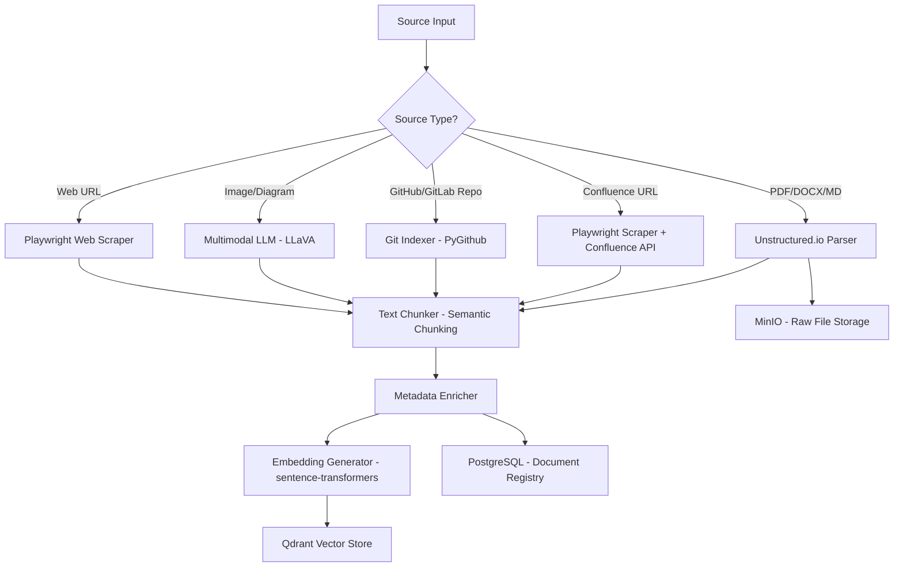
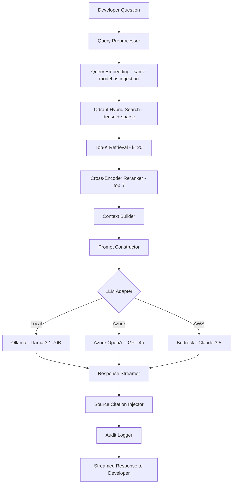
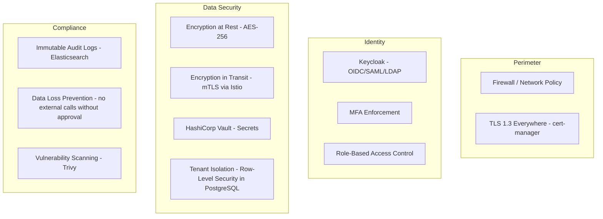

# DevOnboard AI — Enterprise Developer Onboarding Platform
## Comprehensive Architecture & Implementation Plan

> **Product Name (working title):** DevOnboard AI  
> **Deployment Model:** On-Premise (within client's own infrastructure)  
> **LLM Strategy:** Pluggable — Self-hosted (Ollama/vLLM) OR Private Cloud (Azure OpenAI, AWS Bedrock)  
> **Data Privacy:** Zero data leaves client infrastructure — fully air-gapped capable  

---

## 1. Product Vision & Core Features

### What We're Building
An AI-powered developer onboarding platform that acts as an intelligent knowledge base for engineering teams. Project leads upload all project context (docs, Confluence pages, diagrams, PRDs, code repos), and new developers get instant, accurate, context-aware answers with source citations.

### Core Feature Set

| Feature | Description |
|---|---|
| **Document Ingestion** | Upload PDFs, Word docs, Markdown, Notion exports, diagrams |
| **Confluence Scraper** | Authenticated scraping of Confluence spaces with incremental sync |
| **GitHub/GitLab Integration** | Index code repos, README files, CI/CD configs, architecture docs |
| **Vectorless RAG** | Semantic search + LLM synthesis with source attribution |
| **Chat Interface** | Conversational Q&A with follow-up context retention |
| **Environment Setup Guide** | AI-generated step-by-step setup instructions from repo analysis |
| **Project Knowledge Graph** | Visual map of project components, services, and relationships |
| **Role-Based Access** | Admin, Project Lead, Developer roles with project-level permissions |
| **Audit Logs** | Full audit trail of who asked what and what was answered |
| **Multi-Project Support** | Isolated knowledge bases per project within an organization |

---

## 2. Recommended Tech Stack

### Why This Stack?

The stack is chosen for: maximum AI/ML ecosystem compatibility, production-grade reliability, on-premise deployability via Docker/Kubernetes, and strong open-source community support.

### Backend — Python + FastAPI

```
Language:     Python 3.12+
Framework:    FastAPI (async, high performance, OpenAPI auto-docs)
Task Queue:   Celery + Redis (async document processing pipelines)
ORM:          SQLAlchemy 2.0 + Alembic (migrations)
Auth:         Keycloak (enterprise SSO, SAML, OIDC, LDAP/AD integration)
```

**Why Python?** The entire AI/ML ecosystem (LangChain, LlamaIndex, HuggingFace, sentence-transformers) is Python-native. FastAPI gives us async performance comparable to Node.js with full type safety via Pydantic.

### Frontend — Next.js 14 + TypeScript

```
Framework:    Next.js 14 (App Router, Server Components)
Language:     TypeScript
UI Library:   shadcn/ui + Tailwind CSS
State:        Zustand + React Query (TanStack Query)
Chat UI:      Vercel AI SDK (streaming responses)
Diagrams:     React Flow (knowledge graph visualization)
Auth:         NextAuth.js (integrates with Keycloak)
```

### AI / RAG Pipeline

```
RAG Framework:      LlamaIndex (production-grade, enterprise features)
Embedding Models:   sentence-transformers/all-MiniLM-L6-v2 (self-hosted)
                    OR text-embedding-ada-002 (Azure OpenAI private endpoint)
Vector Database:    Qdrant (self-hosted, high performance, filtering support)
LLM Options:        Ollama (Llama 3.1, Mistral, Qwen2.5 — fully local)
                    Azure OpenAI (private endpoint, no data leaves VNet)
                    AWS Bedrock (VPC endpoint, Claude/Titan models)
Reranker:           cross-encoder/ms-marco-MiniLM-L-6-v2 (improves accuracy)
Document Parser:    Unstructured.io (handles PDF, DOCX, HTML, images with OCR)
```

### Data Layer

```
Primary DB:         PostgreSQL 16 (metadata, users, projects, audit logs)
Vector Store:       Qdrant (embeddings, semantic search)
Cache:              Redis 7 (session cache, rate limiting, task queue)
Object Storage:     MinIO (S3-compatible, self-hosted file storage)
Search:             Elasticsearch 8 (full-text search, log aggregation)
```

### Infrastructure & DevOps

```
Containerization:   Docker + Docker Compose (development)
Orchestration:      Kubernetes (production, Helm charts provided)
Service Mesh:       Istio (mTLS between services, traffic management)
Ingress:            Nginx Ingress Controller + cert-manager (TLS)
Monitoring:         Prometheus + Grafana (metrics)
Logging:            Loki + Grafana (log aggregation)
Tracing:            OpenTelemetry + Jaeger (distributed tracing)
Secrets:            HashiCorp Vault (secrets management)
CI/CD:              GitLab CI / GitHub Actions (for the product itself)
```

### Scraping & Integration

```
Web Scraping:       Playwright (headless browser, handles JS-rendered pages)
Confluence API:     Atlassian REST API v2 (authenticated, incremental sync)
GitHub/GitLab:      PyGithub / python-gitlab (repo indexing)
Document Parsing:   Unstructured.io + Apache Tika (multi-format support)
Diagram Analysis:   GPT-4V / LLaVA (multimodal — reads architecture diagrams)
```

---

## 3. System Architecture

### High-Level Architecture Diagram



### Service Architecture (Microservices)



---

## 4. RAG Pipeline — Detailed Design

### Document Ingestion Flow



### Query / Chat Flow



### Chunking Strategy

| Content Type | Chunking Strategy | Chunk Size | Overlap |
|---|---|---|---|
| Technical Docs | Semantic chunking | 512 tokens | 50 tokens |
| Code Files | Function/class level | Variable | None |
| Confluence Pages | Section-based | 1024 tokens | 100 tokens |
| PRDs | Paragraph-level | 512 tokens | 50 tokens |
| Diagrams | Full image + caption | N/A | N/A |
| README files | Section-based | 512 tokens | 50 tokens |

---

## 5. Security Architecture

### Zero-Trust Security Model



### Key Security Controls

1. **Data Isolation**: Each organization's data is isolated using PostgreSQL Row-Level Security (RLS) and separate Qdrant collections per project
2. **No External Data Leakage**: LLM calls go only to configured endpoints (local Ollama or private cloud endpoints within VNet)
3. **Secrets Management**: All API keys, DB passwords stored in HashiCorp Vault — never in environment variables or config files
4. **mTLS**: All inter-service communication encrypted via Istio service mesh
5. **RBAC**: Keycloak-managed roles: `org_admin`, `project_lead`, `developer`, `viewer`
6. **Audit Trail**: Every query, document upload, and admin action logged immutably
7. **Network Policies**: Kubernetes NetworkPolicies restrict pod-to-pod communication to only what's needed
8. **Image Scanning**: All Docker images scanned with Trivy before deployment
9. **OWASP Top 10**: FastAPI middleware for SQL injection prevention, XSS, CSRF protection

---

## 6. Multi-Tenancy Design

### Organization → Project → Knowledge Base Hierarchy

```
Organization (Tenant)
├── Projects
│   ├── Project A
│   │   ├── Knowledge Base (isolated Qdrant collection)
│   │   ├── Documents
│   │   ├── Confluence Spaces
│   │   └── Git Repositories
│   └── Project B
│       └── ...
├── Users
│   ├── Org Admin
│   ├── Project Leads (per project)
│   └── Developers (per project)
└── LLM Configuration (org-level)
    ├── Provider: Ollama / Azure OpenAI / AWS Bedrock
    └── Model Selection
```

### Data Isolation Strategy

- **PostgreSQL**: Row-Level Security (RLS) policies enforce `org_id` and `project_id` filtering on every query
- **Qdrant**: Separate named collections per project (`{org_id}_{project_id}_vectors`)
- **MinIO**: Separate buckets per organization with bucket policies
- **Redis**: Key namespacing with `{org_id}:{project_id}:` prefix

---

## 7. API Design

### Core API Endpoints

```
Authentication
  POST   /api/v1/auth/login
  POST   /api/v1/auth/refresh
  POST   /api/v1/auth/logout

Organizations
  POST   /api/v1/orgs
  GET    /api/v1/orgs/{org_id}
  PUT    /api/v1/orgs/{org_id}/llm-config

Projects
  POST   /api/v1/orgs/{org_id}/projects
  GET    /api/v1/orgs/{org_id}/projects
  GET    /api/v1/orgs/{org_id}/projects/{project_id}
  DELETE /api/v1/orgs/{org_id}/projects/{project_id}

Knowledge Base — Ingestion
  POST   /api/v1/projects/{project_id}/documents          # Upload files
  POST   /api/v1/projects/{project_id}/confluence         # Add Confluence space
  POST   /api/v1/projects/{project_id}/repositories       # Add Git repo
  POST   /api/v1/projects/{project_id}/urls               # Add web URLs
  GET    /api/v1/projects/{project_id}/sources            # List all sources
  DELETE /api/v1/projects/{project_id}/sources/{source_id}
  POST   /api/v1/projects/{project_id}/sync               # Trigger re-sync

Chat
  POST   /api/v1/projects/{project_id}/chat               # New conversation
  GET    /api/v1/projects/{project_id}/chat/{session_id}  # Get history
  WS     /api/v1/projects/{project_id}/chat/stream        # Streaming chat

Search
  POST   /api/v1/projects/{project_id}/search             # Semantic search

Audit
  GET    /api/v1/orgs/{org_id}/audit-logs
  GET    /api/v1/projects/{project_id}/audit-logs

Admin
  GET    /api/v1/admin/health
  GET    /api/v1/admin/metrics
  POST   /api/v1/admin/reindex/{project_id}
```

---

## 8. Frontend Application Design

### Application Pages & Features

```
/login                          — SSO login (Keycloak redirect)
/dashboard                      — Projects overview, recent activity
/projects/new                   — Create new project
/projects/{id}                  — Project dashboard
/projects/{id}/chat             — Main chat interface (developer view)
/projects/{id}/knowledge-base   — Knowledge base management (project lead)
/projects/{id}/sources          — Manage sources (docs, Confluence, repos)
/projects/{id}/graph            — Knowledge graph visualization (React Flow)
/projects/{id}/settings         — Project settings, member management
/org/settings                   — Organization settings, LLM config
/org/users                      — User management
/org/audit-logs                 — Audit log viewer
/admin                          — System admin panel
```

### Chat Interface Features
- **Streaming responses** via WebSocket (token-by-token display)
- **Source citations** with clickable links to original documents
- **Conversation history** with session management
- **Code syntax highlighting** in responses
- **Suggested follow-up questions** based on context
- **Feedback mechanism** (thumbs up/down for response quality)
- **Context window indicator** showing which sources were used

---

## 9. Confluence & GitHub Integration

### Confluence Integration

```python
# Confluence Scraper Strategy
1. OAuth 2.0 authentication with Confluence Cloud/Server
2. Discover all spaces the service account has access to
3. Recursively fetch pages using Confluence REST API v2
4. Parse page content (HTML → clean text via BeautifulSoup)
5. Extract attachments (PDFs, images, diagrams)
6. Store page hierarchy as metadata for context
7. Incremental sync via page version tracking
8. Webhook support for real-time updates (Confluence Cloud)
```

### GitHub/GitLab Integration

```python
# Repository Indexing Strategy
1. Clone repo (shallow clone for large repos)
2. Index: README.md, docs/, wiki/, architecture/, .github/
3. Parse code structure: functions, classes, modules (tree-sitter)
4. Extract inline documentation and docstrings
5. Index CI/CD configs (.github/workflows, .gitlab-ci.yml)
6. Track dependency files (package.json, requirements.txt, pom.xml)
7. Generate environment setup guide from Dockerfile, docker-compose.yml
8. Webhook for incremental updates on push events
```

---

## 10. Environment Setup Guide Generation

One of the killer features — automatically generating developer setup guides:

```
Input:  Git repository
Output: Step-by-step setup guide

Process:
1. Detect tech stack from package.json / requirements.txt / pom.xml / go.mod
2. Parse Dockerfile and docker-compose.yml for service dependencies
3. Extract environment variables from .env.example, README
4. Identify database migrations, seed scripts
5. Detect CI/CD pipeline for test commands
6. LLM synthesizes all above into a personalized setup guide
7. Guide includes: prerequisites, installation steps, env setup, running tests, common issues
```

---

## 11. Deployment Architecture

### Kubernetes Deployment (Production)

```
Namespace: devonboard-{org-name}

Deployments:
  - devonboard-api          (FastAPI, 3 replicas, HPA)
  - devonboard-frontend     (Next.js, 2 replicas)
  - devonboard-worker       (Celery workers, 5 replicas, KEDA autoscaling)
  - devonboard-qdrant       (StatefulSet, 3 nodes for HA)
  - devonboard-postgres     (StatefulSet, primary + 1 replica, PgBouncer)
  - devonboard-redis        (StatefulSet, Redis Sentinel for HA)
  - devonboard-minio        (StatefulSet, distributed mode)
  - devonboard-keycloak     (2 replicas, clustered)
  - devonboard-ollama       (StatefulSet, GPU node if available)
  - devonboard-vault        (HashiCorp Vault, HA mode)

Monitoring Stack (separate namespace: monitoring):
  - prometheus
  - grafana
  - loki
  - jaeger
  - alertmanager
```

### Helm Chart Structure

```
devonboard/
├── Chart.yaml
├── values.yaml                 # Default values
├── values-production.yaml      # Production overrides
├── values-gpu.yaml             # GPU-enabled Ollama config
├── templates/
│   ├── api/
│   ├── frontend/
│   ├── worker/
│   ├── qdrant/
│   ├── postgres/
│   ├── redis/
│   ├── minio/
│   ├── keycloak/
│   ├── ollama/
│   └── vault/
└── charts/                     # Sub-charts
```

### Minimum Hardware Requirements (On-Premise)

| Component | CPU | RAM | Storage | Notes |
|---|---|---|---|---|
| API Server | 4 cores | 8 GB | 50 GB | 3 replicas |
| Celery Workers | 8 cores | 16 GB | 100 GB | 5 replicas |
| PostgreSQL | 4 cores | 16 GB | 500 GB SSD | Primary + replica |
| Qdrant | 8 cores | 32 GB | 500 GB SSD | 3-node cluster |
| Redis | 2 cores | 8 GB | 50 GB | Sentinel mode |
| MinIO | 4 cores | 8 GB | 2 TB | Distributed |
| Ollama (optional) | 8 cores + GPU | 32 GB | 200 GB | NVIDIA GPU recommended |
| Keycloak | 2 cores | 4 GB | 20 GB | 2 replicas |
| Monitoring | 4 cores | 8 GB | 200 GB | Prometheus + Grafana |

---

## 12. Project Structure

```
devonboard/
├── backend/
│   ├── app/
│   │   ├── api/
│   │   │   ├── v1/
│   │   │   │   ├── auth.py
│   │   │   │   ├── projects.py
│   │   │   │   ├── ingestion.py
│   │   │   │   ├── chat.py
│   │   │   │   └── search.py
│   │   ├── core/
│   │   │   ├── config.py
│   │   │   ├── security.py
│   │   │   └── database.py
│   │   ├── models/
│   │   │   ├── organization.py
│   │   │   ├── project.py
│   │   │   ├── document.py
│   │   │   └── chat.py
│   │   ├── services/
│   │   │   ├── rag/
│   │   │   │   ├── pipeline.py
│   │   │   │   ├── embeddings.py
│   │   │   │   ├── retriever.py
│   │   │   │   └── llm_adapter.py
│   │   │   ├── ingestion/
│   │   │   │   ├── confluence.py
│   │   │   │   ├── github.py
│   │   │   │   ├── document_parser.py
│   │   │   │   └── web_scraper.py
│   │   │   └── chat_service.py
│   │   └── workers/
│   │       ├── celery_app.py
│   │       ├── ingestion_tasks.py
│   │       └── sync_tasks.py
│   ├── alembic/               # DB migrations
│   ├── tests/
│   ├── Dockerfile
│   └── pyproject.toml
│
├── frontend/
│   ├── src/
│   │   ├── app/               # Next.js App Router
│   │   ├── components/
│   │   │   ├── chat/
│   │   │   ├── knowledge-base/
│   │   │   └── ui/            # shadcn components
│   │   ├── lib/
│   │   └── hooks/
│   ├── Dockerfile
│   └── package.json
│
├── infrastructure/
│   ├── helm/
│   │   └── devonboard/        # Helm chart
│   ├── terraform/             # Optional: cloud infra
│   ├── docker-compose.yml     # Local development
│   └── docker-compose.prod.yml
│
├── docs/
│   ├── architecture.md
│   ├── deployment-guide.md
│   ├── api-reference.md
│   └── admin-guide.md
│
└── scripts/
    ├── setup-dev.sh
    ├── seed-data.sh
    └── health-check.sh
```

---

## 13. Implementation Phases

### Phase 1 — Foundation (MVP)
- [ ] Project scaffolding (backend + frontend + Docker Compose)
- [ ] PostgreSQL schema + Alembic migrations
- [ ] Keycloak setup with RBAC
- [ ] Basic FastAPI with auth middleware
- [ ] Next.js app with login + dashboard skeleton
- [ ] MinIO setup for file storage
- [ ] Qdrant setup with basic vector operations
- [ ] PDF/DOCX document upload + parsing (Unstructured.io)
- [ ] Basic embedding pipeline (sentence-transformers)
- [ ] Ollama integration (local LLM)
- [ ] Basic RAG chat endpoint
- [ ] Simple chat UI with streaming

### Phase 2 — Integrations
- [ ] Confluence scraper (REST API + Playwright fallback)
- [ ] GitHub/GitLab repository indexer
- [ ] Incremental sync with webhooks
- [ ] Azure OpenAI + AWS Bedrock LLM adapters
- [ ] Cross-encoder reranker integration
- [ ] Source citation in responses
- [ ] Conversation history + session management
- [ ] Web URL scraper

### Phase 3 — Advanced Features
- [ ] Knowledge graph visualization (React Flow)
- [ ] Environment setup guide generator
- [ ] Multimodal diagram analysis (LLaVA)
- [ ] Semantic chunking improvements
- [ ] Feedback mechanism + response quality tracking
- [ ] Advanced RBAC + project-level permissions
- [ ] Audit log viewer UI

### Phase 4 — Production Hardening
- [ ] Kubernetes Helm charts
- [ ] Prometheus + Grafana dashboards
- [ ] Loki log aggregation
- [ ] Jaeger distributed tracing
- [ ] HashiCorp Vault integration
- [ ] Istio service mesh + mTLS
- [ ] Load testing + performance optimization
- [ ] Security audit + penetration testing
- [ ] Documentation (deployment guide, admin guide, API reference)
- [ ] Installer script for on-premise deployment

---

## 14. Monetization & Licensing

### Licensing Model (for selling to enterprises)
- **License-based**: Annual license per organization
- **Tiers**:
  - **Starter**: Up to 5 projects, 10 users, 10GB storage
  - **Professional**: Up to 20 projects, 50 users, 100GB storage
  - **Enterprise**: Unlimited projects/users, custom storage, SLA, dedicated support
- **License enforcement**: License key validation (offline-capable for air-gapped deployments)
- **License server**: Optional self-hosted license server for large enterprises

---

## 15. Key Differentiators

1. **100% On-Premise**: Data never leaves client infrastructure — critical for regulated industries (banking, healthcare, defense)
2. **Pluggable LLM**: Works with local Llama 3 or enterprise Azure/AWS — no vendor lock-in
3. **Source Citations**: Every answer links back to the original document/page — builds trust
4. **Confluence-Native**: Deep Confluence integration with incremental sync — not just file uploads
5. **Code-Aware**: Understands code repos, generates setup guides — not just a document Q&A
6. **Enterprise Auth**: LDAP/AD/SAML via Keycloak — plugs into existing enterprise identity
7. **Audit Trail**: Full compliance-ready audit logs — required for enterprise procurement
8. **Kubernetes-Native**: Helm charts for easy deployment on any K8s cluster (EKS, GKE, AKS, on-prem)
